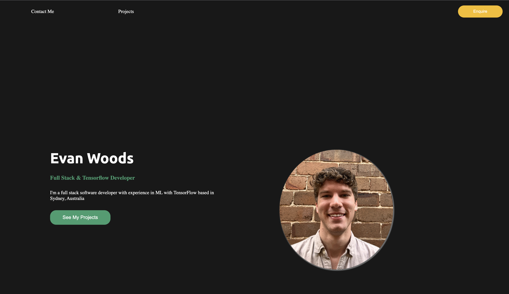

# Evan-Woods-Portfolio

This repository contains the code for my personal portfolio website. It was built using standard HTML, CSS, and JavaScript. It follows responsive design standards and demonstrates the projects that I have built, along with the skills I have accuired in my programming carreer.

The website contains links to my social media that is tied to my programming career, including LinkedIn, Email, and Instagram. 

The repository is also the week 8 homework for the "University of Sydney Full Stack FLex" bootcamp, and will continue to be updated in the future as new projects are worked on.

## Project Images

On loading the page, a user sees the introductory view, including my name, a brief description and a button to view my projects.

Projects are clickable and once selected, the name gets highlighted and project information is displayed, with links to take a user to the github repository and the website (if it has one).

My contact information is available on each of the icons representing the platform, clicking them will redirect a user to the page to interact with the specified media platform.

## The website is viewable here:
https://evancwoods.github.io/Evan-Woods-Portfolio/ 
