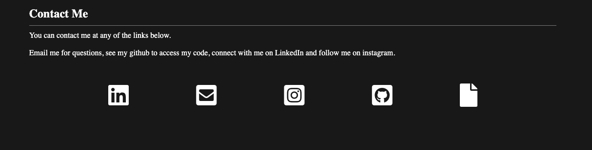

# Evan-Woods-Portfolio

This repository contains the code for my personal portfolio website. It was built using standard HTML, CSS, and JavaScript. It follows responsive design standards and demonstrates the projects that I have built, along with the skills I have accuired in my programming carreer.

The website contains links to my social media that is tied to my programming career, including LinkedIn, Email, and Instagram. 

The repository is also the week 8 homework for the "University of Sydney Full Stack Flex" bootcamp, and will continue to be updated in the future as new projects are worked on.

## Project Images

On loading the page, a user sees the introductory view, including my name, a brief description and a button to view my projects.

Projects are clickable and once selected, the name gets highlighted and project information is displayed, with links to take a user to the github repository and the website (if it has one).

My contact information is available on each of the icons representing the platform, clicking them will redirect a user to the page to interact with the specified media platform.

## The website is viewable here:
https://evancwoods.github.io/Evan-Woods-Portfolio/ 

## License
 
The MIT License (MIT)

Copyright (c) 2022 Evan Woods

Permission is hereby granted, free of charge, to any person obtaining a copy of this software and associated documentation files (the "Software"), to deal in the Software without restriction, including without limitation the rights to use, copy, modify, merge, publish, distribute, sublicense, and/or sell copies of the Software, and to permit persons to whom the Software is furnished to do so, subject to the following conditions:

The above copyright notice and this permission notice shall be included in all copies or substantial portions of the Software.

THE SOFTWARE IS PROVIDED "AS IS", WITHOUT WARRANTY OF ANY KIND, EXPRESS OR IMPLIED, INCLUDING BUT NOT LIMITED TO THE WARRANTIES OF MERCHANTABILITY, FITNESS FOR A PARTICULAR PURPOSE AND NONINFRINGEMENT. IN NO EVENT SHALL THE AUTHORS OR COPYRIGHT HOLDERS BE LIABLE FOR ANY CLAIM, DAMAGES OR OTHER LIABILITY, WHETHER IN AN ACTION OF CONTRACT, TORT OR OTHERWISE, ARISING FROM, OUT OF OR IN CONNECTION WITH THE SOFTWARE OR THE USE OR OTHER DEALINGS IN THE SOFTWARE.
